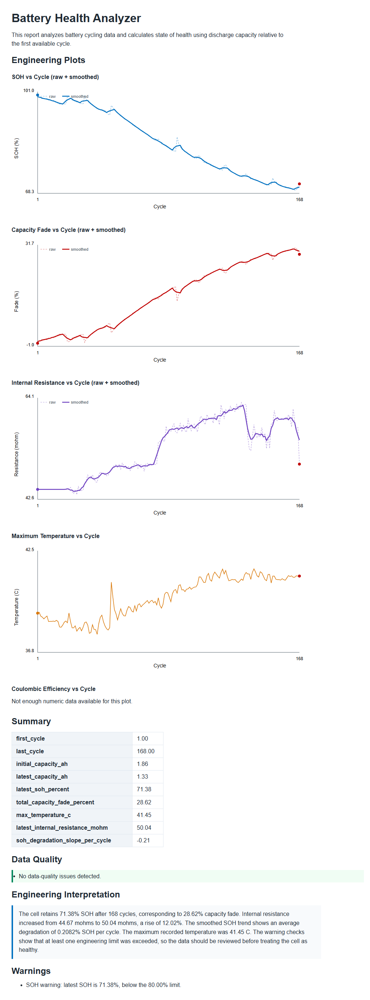
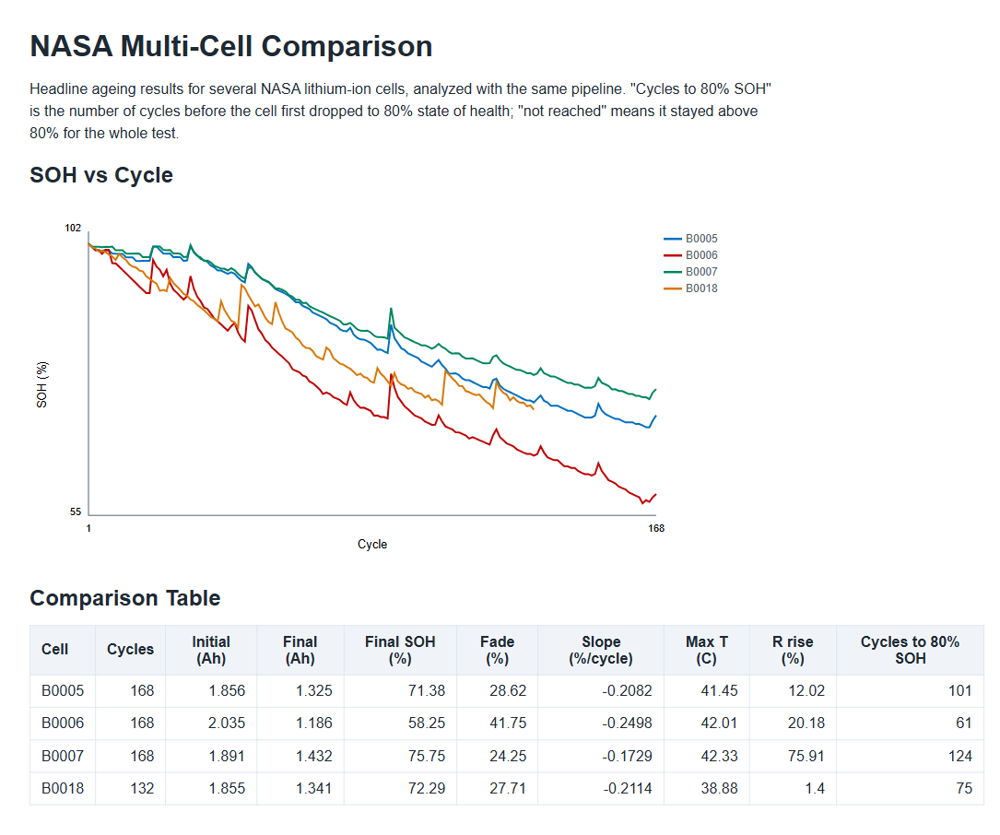

# Battery Health Analyzer

A Python pipeline that analyzes lithium-ion battery aging data, calculates state
of health (SOH) and degradation trends, validates data quality, compares
multiple cells, and generates engineering-style HTML reports — built on the
public **NASA Li-ion battery aging dataset**.

> This is a portfolio / learning project. It is **not** a production battery
> management system (BMS), a safety-certification tool, or a real-time monitoring
> system, and it does not predict exact remaining useful life.

---

## The engineering problem

Lithium-ion cells lose capacity and gain internal resistance as they age. To
judge how healthy a cell is, an engineer needs to:

1. Convert raw cycling test data into clean, cycle-level measurements.
2. Calculate **state of health (SOH)** and **capacity fade** over the cell's life.
3. Track **internal resistance** and **temperature** trends.
4. Smooth the noisy real-world data to see the underlying degradation trend.
5. Check the results against engineering limits and flag concerns.
6. Confirm the input data itself is trustworthy.

This project automates that workflow end to end and produces a shareable report,
so the same analysis can be repeated consistently across different cells.

---

## Example results

### Single-cell report (NASA B0005)



NASA cell **B0005** after 168 discharge cycles:

| Metric | Value |
|---|---|
| Initial capacity | 1.856 Ah |
| Final capacity | 1.325 Ah |
| Latest SOH | 71.38 % |
| Capacity fade | 28.62 % |
| Internal resistance rise | 12.02 % |
| Max temperature | 41.45 °C |
| SOH degradation slope | −0.21 % per cycle |

### Multi-cell comparison (B0005, B0006, B0007, B0018)



| Cell | Cycles | Final SOH | Fade | Slope (%/cycle) | Max T (°C) | R rise | Cycles to 80% SOH |
|---|---|---|---|---|---|---|---|
| B0005 | 168 | 71.38 % | 28.62 % | −0.2082 | 41.45 | 12.02 % | 101 |
| B0006 | 168 | 58.25 % | 41.75 % | −0.2498 | 42.01 | 20.18 % | 61 |
| B0007 | 168 | 75.75 % | 24.25 % | −0.1729 | 42.33 | 75.91 % | 124 |
| B0018 | 132 | 72.29 % | 27.71 % | −0.2114 | 38.88 | 1.40 % | 75 |

**B0006 aged fastest** (steepest slope, reached 80% SOH after only 61 cycles);
**B0007 aged slowest** but showed the largest resistance rise.

---

## Architecture

```
Battery_Health_Analyzer_Project/
├── main.py                      # Single-cell analysis (CLI entry point)
├── config/
│   └── limits.json              # Engineering warning thresholds (editable)
├── data/
│   ├── sample_battery_cycles.csv  # Small built-in fallback dataset
│   ├── raw/nasa/                  # NASA .mat files (not committed — see below)
│   └── processed/                 # Converted cycle-level CSVs
├── scripts/
│   ├── convert_nasa_dataset.py  # .mat -> CSV for B0005/B0006/B0007/B0018
│   └── compare_nasa_cells.py    # Builds the multi-cell comparison
├── src/battery_health/
│   ├── data_loader.py           # Loads CSV, checks required columns
│   ├── nasa_importer.py         # Parses NASA MATLAB .mat structures
│   ├── metrics.py               # SOH, capacity fade, efficiency, smoothing, slope
│   ├── validation.py            # Engineering warnings vs. configured limits
│   ├── data_quality.py          # Data-integrity checks
│   ├── comparison.py            # Multi-cell analysis + comparison report
│   ├── interpretation.py        # Plain-language engineering summary
│   └── report.py                # Standalone HTML report with SVG plots
├── tests/                       # pytest suite (47 tests)
└── docs/                        # Step-by-step explanations + screenshots
```

The flow for a single cell:

```
load CSV ─▶ data-quality check ─▶ metrics (SOH/fade/smoothing/slope)
        ─▶ warnings ─▶ interpretation ─▶ HTML report + CSV + text outputs
```

---

## Dataset

**NASA Prognostics Center of Excellence — Battery Data Set**
B. Saha and K. Goebel (2007), NASA Ames Research Center, Moffett Field, CA.
NASA Prognostics Data Repository.

Four cells (B0005, B0006, B0007, B0018) were repeatedly charged, discharged
(constant current, 2 A), and impedance-tested at room temperature until they
reached end-of-life (≈30% capacity fade). Each `.mat` file holds per-cycle
voltage, current, temperature, time, discharge capacity, and EIS-derived
electrolyte resistance.

> The raw `.mat` files (and the original ZIP) are **large** and are **not**
> committed to this repository. Download them from the NASA Prognostics Data
> Repository and place them in `data/raw/nasa/`. A small synthetic
> `sample_battery_cycles.csv` is included so the tool runs without the dataset.

**Known data limitation:** the converted NASA cycles contain discharge capacity
but not a simple cycle-level *charge* capacity, so **coulombic efficiency is not
available for the NASA cells** and is left blank rather than estimated. The
sample dataset includes charge capacity, so efficiency is shown there.

---

## Installation

Requires Python 3.10+.

```bash
# 1. (optional) create a virtual environment
python -m venv .venv
# Windows:  .venv\Scripts\activate
# macOS/Linux:  source .venv/bin/activate

# 2. install runtime dependencies (pandas, numpy, scipy)
python -m pip install -r requirements.txt

# 3. (optional) install test tools
python -m pip install -r requirements-dev.txt
```

---

## Commands

```bash
# Analyze the default cell (NASA B0005 if converted, otherwise the sample data)
python main.py

# Analyze any cycle CSV
python main.py --data data/sample_battery_cycles.csv

# Convert the NASA .mat files to CSV (needs the .mat files in data/raw/nasa/)
python scripts/convert_nasa_dataset.py

# Build the multi-cell comparison (needs the converted CSVs)
python scripts/compare_nasa_cells.py

# Run the automated test suite
pytest
```

### Outputs (written to `results/`)

| File | Contents |
|---|---|
| `step1_report.html` | Full single-cell report (plots, summary, quality, warnings) |
| `step1_summary.csv` | Per-cycle analyzed data |
| `step2_warnings.txt` | Engineering warnings |
| `step4_interpretation.txt` | Plain-language summary |
| `step9_data_quality.txt` | Data-quality findings |
| `nasa_comparison.csv` | Multi-cell comparison table |
| `nasa_comparison.html` | Multi-cell report with overlaid SOH curves |

---

## How the key metrics are calculated

- **SOH (%)** = discharge capacity of the cycle ÷ baseline capacity × 100. The
  baseline is the first cycle's capacity (or a supplied nominal capacity).
- **Capacity fade (%)** = 100 − SOH.
- **Coulombic efficiency (%)** = discharge capacity ÷ charge capacity × 100,
  only when charge capacity exists.
- **Smoothing** = a centered 5-cycle rolling average, so the underlying trend is
  visible without hiding the raw (noisy) data — both are plotted.
- **Degradation slope** = slope of a straight line fitted to the smoothed SOH vs.
  cycle, reported as % SOH lost per cycle.
- **Cycles to 80% SOH** = the first cycle where SOH drops to 80% (a common
  end-of-life marker), or "not reached".

---

## Configurable engineering limits

Warning thresholds live in `config/limits.json` so they can be changed without
touching the code:

```json
{
  "soh_limit_percent": 80.0,
  "temperature_limit_c": 45.0,
  "resistance_rise_limit_percent": 20.0,
  "coulombic_efficiency_limit_percent": 98.0
}
```

---

## Assumptions

- The first cycle's discharge capacity is a fair baseline for SOH (unless a
  nominal capacity is given).
- All cycles in a file belong to the same cell under comparable conditions.
- Internal resistance is approximated from the nearest available EIS electrolyte
  resistance (`Re`) measurement.
- The warning limits are illustrative engineering defaults, not certified values.

## Limitations

- Not a real BMS; no real-time monitoring or safety certification.
- No remaining-useful-life *prediction* — only observed trends and a simple slope.
- Coulombic efficiency is unavailable for the NASA cells (no charge-capacity data).
- Resistance is an approximation, not a full electrochemical model.
- Tested mainly on the NASA dataset format and the bundled sample data.

## Future improvements

- Basic SOH prediction with scikit-learn, evaluated with MAE / RMSE.
- Curve fitting for the degradation trend (e.g. exponential models).
- A Streamlit dashboard for interactive exploration.
- PyBaMM physics-based simulation, compared against the experimental data.

---

## Testing

```bash
pytest          # run all tests
pytest -v       # one line per test
```

The suite (47 tests) covers SOH, capacity fade, coulombic efficiency, smoothing,
the degradation slope, config loading, every warning, all data-quality checks,
the multi-cell comparison, missing/invalid data, and the NASA conversion. The
NASA conversion test is skipped automatically if the `.mat` files are absent, so
`pytest` stays green on a fresh clone.

---

## Documentation

Step-by-step, beginner-friendly explanations of each part of the pipeline live in
[`docs/`](docs/) (`STEP_1` through `STEP_10`).

## Dataset citation

> B. Saha and K. Goebel (2007). "Battery Data Set", NASA Prognostics Data
> Repository, NASA Ames Research Center, Moffett Field, CA.
